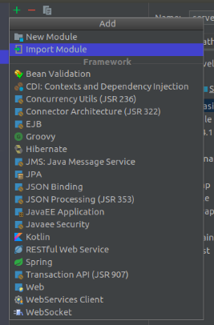

&nbsp;&nbsp;
&nbsp;&nbsp;
&nbsp;&nbsp;

# Table of Contents
* [Overview](#overview)
* [Ready for production](#ready-for-production)
* [How to start developing](#how-to-start-developing)

## Overview
The project consists of two main (independent) modules:

 - [Spring Boot application](./server)
   
 - [Angular application](./client)
  
  You can collaborate on any of them independently by modifying only the module you would like to change.

## Ready for production
* Packing as a WAR file with the API server only
  1. From the location `server/` run `gradle bootWar`.
* API + Angular Client
  1. You need to have [Node.js][4] 8.9 or higher, together with [NPM][7] 5.5.1 or higher installed.
  2. Consider modifying the file `client/src/environments/environment.prod.ts`, by setting the value `apiBaseUrl` to the value of the API base url. This takes as default `http://127.0.0.1/gms/api/`.
  3. From the location `client/` run `npm install` in order to install all client package dependencies.
  4. From the location `server/` run `gradle bootWar -Pclient=true`.
  5. Optionally you can generate the client app (Angular) documentation by setting also the `clientDoc` param to true like this `-PclientDoc=true`.
* This will create a WAR file inside `server/build/libs` ready to be deployed.
* Database configuration
  1. Create a [PostgreSQL][5] database.
  2. Open the WAR file and set the proper connection parameters inside the file `WEB-INF/classes/config/application-production.properties`
  3. Save the file and update it inside the WAR file.
  4. Deploy the WAR file.

_**Note:**_ If you don't have [Gradle][6] installed, you can use the command `./gradlew` instead of `gradle` for the previous mentioned steps.

## How to start developing
* Make a local working copy of the project (` git clone https://github.com/lealceldeiro/gms.git`).

### IntelliJ IDEA
#### API Server module
* Open (import) the folder **server** in the working copy of the project.

* Configure the [gradle][1] options.

  1. Select the distribution of gradle to be used. The default option is "_Use default gradle wrapper_", but if you like you can check the "_Use local gradle distribution_" if you have gradle installed on your PC (in which case you must set the "Gradle home" directory.
  2. Select the JVM.
  3. Select the project format (`.idea (directory based)` in this case).
* This will create an IntelliJ IDEA project with one module (_server_). Here you should choose to add the root directory to the VCS.

#### Client module
* `Open Module Settings` (F4) and add a new module (+ green sign) and select the `Import Module` option.

* Select the folder `client` in the same level of the `server` folder.

* Select the option "_Create module from existing source_".

* _Next_.
* In the window "Import Module", keep the checkbox checked and click "Next";

* _Finish_ (this will search for the [Angular CLI][2] framework) installed through the [angular-cli node package][3].

* This will create another module on the project (_client_).

#### At this point the project should contain two modules (_server_ and _client_)

[1]: https://gradle.org/
[2]: https://cli.angular.io/
[3]: https://www.npmjs.com/package/angular-cli
[4]: https://nodejs.org/en/
[5]: https://www.postgresql.org/
[6]: https://gradle.org/
[7]: https://www.npmjs.com/get-npm
